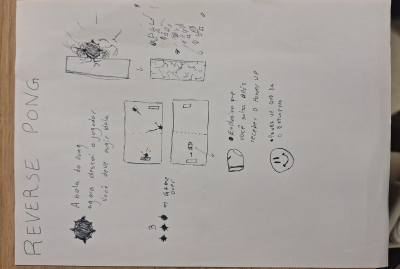
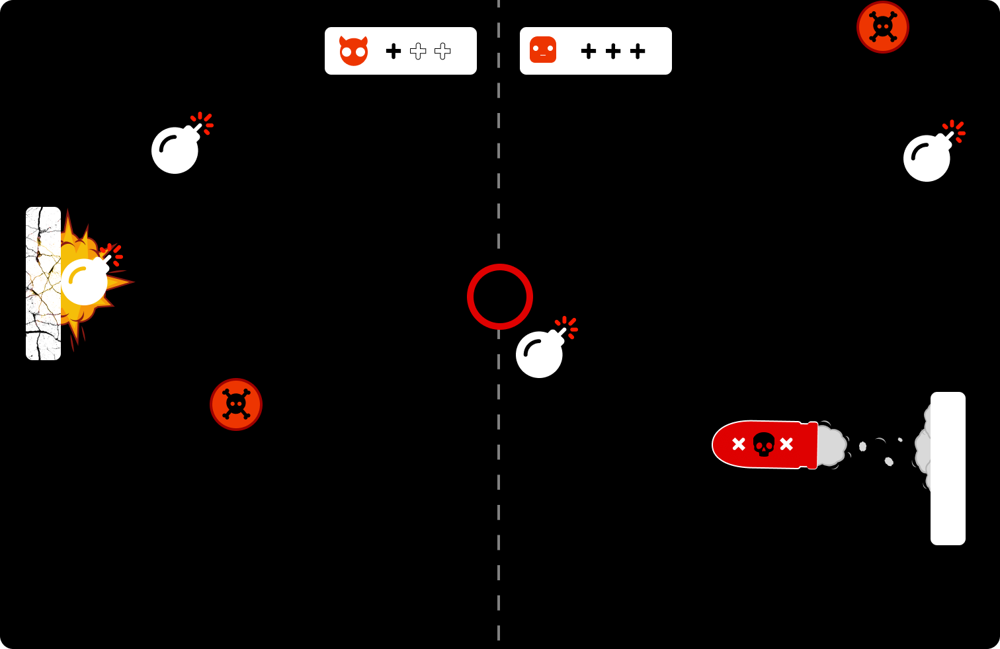
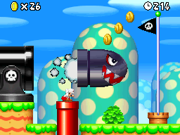

# Relatório - Reinventando Pong

## 1. Introdução

_Descreva brevemente o objetivo da atividade, mencionando a proposta de reinvenção do jogo Pong e a abordagem escolhida pela dupla._
 
Escolhemos inverter o pong original, com o objetivo de desviar de bombas para não ser destruido. Também adicionamos a funcionalidade de atirar no outro jogador com um power-up especial.

---

## 2. Pesquisa e Análise Inicial

_Explique as principais características do **jogo original Pong**, considerando os três elementos do **Framework MDA** e responda: o que torna Pong um jogo envolvente e jogável? Quais são seus **elementos principais de diversão e desafio**?_
 

_**MDA** - Mecânica, Dinâmica e Estética_

As principais características do Pong original considerando o MDA são o movimento vertical das barras e a fisica da bola (Mecânicas), a competição direta com o outro jogador e as táticas de posicionamento (Dinâmicas) e o minimalismo visual na parte da Estética. O pong é envolvente e jogavel pois ele é muito acessivel por ser um jogo muito simples e facil de aprender. Seus elementos principais de diversão e desafio é a competição contra a outro jogador e prevendo onde a bola iria cair, o tornando mais facil e mais dificil dependendo dos jogadores.

Um dos principais fatores que faz do Pong ser um dos jogos mais aclamados é sua simplicidade e eficiência em como se comunica com o jogador e cria uma dinâmica divertida e competitiva. O jogo não possui nenhum tutorial, dois bastões em cada lado da tela e um quadrado no meio imediatamente deixa claro o objetivo final. Além disso, seus elementos simples e paleta de duas cores (preto e branco),

---

## 3. Proposta de Reinvenção

_Explique as mudanças propostas para a nova versão do **Pong**, detalhando:_

_- **Tema e Ambientação:** Qual é o novo contexto do jogo?_

O tema se mantém simples, apeas de possuir um novo cenário e ser mais focado em desviar de bombas do que acertar bolas. O contexto se inverte comparado a o pong original.

_- **Personagens ou Elementos Visuais:** Se houver personagens ou variações visuais, descreva._
  
Os dois jogadores mantem o mesmo visual, mas a bola do pong vira uma bomba, capaz de eliminar o outro jogador.

_- **Mudanças na Mecânica:** Houve alguma alteração nas regras ou na forma de jogar?_
  
O jogo agora se consiste em desviar da bola em vez de bater nela e evitar que ela passe pelo jogador.

_- **Objetivo da Reinvenção:** O que a nova versão pretende explorar ou melhorar em relação ao original?_
  
A nova versão deixa o jogo mais complexo e adiciona novas mecanicas para os jogadores obterem mais possibilidades de derrotar o outro jogador.

_Inclua aqui um **rascunho da Folha de Concept Art** e uma explicação sobre como o esboço foi desenvolvido._

### folha de concept art

---

## 4. Tela Digital do Jogo

_- Quais elementos visuais foram aprimorados?_
 
Elementos visuais como a explosão da bomba, o míssil e a HUD foram aprimorados para um visual mais moderno. A bola foi substituída por uma bomba com mais detalhes em relação ao original, e foi adicionada uma interface de usuário para indicar a quantidade de pontos de vida de cada jogador.

_- O uso de cores, formas e layout foi pensado para reforçar que aspectos do jogo?_
 
Por se tratar de um jogo onde a competitividade é o elemento central, foram utilizadas formas e cores claras para destacar os elementos visuais, garantindo uma estética simples e de fácil compreensão.

_- Como o concept foi adaptado para o formato digital?_
 
O jogo foi digitalizado no Figma, e os elementos visuais, como as bombas e o cenário, foram vetorizados. Durante esse processo, as mecânicas principais do jogo foram refinadas, mantendo a essência do jogo original, sem se distanciar excessivamente da ideia central do Pong.

---

## 5. Reflexão e Aprendizados

_Cada membro da dupla deve responder individualmente:_

[Gabriel Bartmanovicz]

1. Quais foram os maiores desafios enfrentados durante o processo de criação?
   Por ser um jogo amplamente conhecido, de mecânicas simples e elementos visuais minimalistas, para mim foi um desafio chegar em conceitos que fossem interessantes e que trouxessem novas dinâmicas e desafios para o jogo sem que ele perdesse os elementos visuais que o tornam tão icônico (Os dois retângulos, a movimentação vertical e a física dos elementos).
2. Que habilidades foram desenvolvidas ou aprimoradas ao longo da atividade?
   Definitivamente a habilidade de abstrair elementos e conceitos únicos para chegar em ideias novas. A mecânica de fazer com que a bola agora destrua o personagem veio da percepção que no jogo original seu objetivo era sempre ir em direção onde a bola estava, quando pensamos em olhar para esse único mecanismo e invertê-lo, chegamos em conceitos complementamente novos que guiaram o desenvolvimento do Concept Art.

[Antonio Di Cillo]

1. Quais foram os maiores desafios enfrentados durante o processo de criação?

Por ser um jogo muito simples, foi difícil encontrar uma ideia que não fugisse do conceito original e, ao mesmo tempo, não fosse excessivamente simples. Conseguimos desenvolver uma ideia criativa que manteve as propostas do jogo original.

2. Que habilidades foram desenvolvidas ou aprimoradas ao longo da atividade?

A habilidade de expandir um conceito sem alterar sua proposta original. Para garantir que o jogo não se desviasse muito de sua ideia central, foi necessário discutir quais elementos fariam mais sentido dentro do contexto do jogo. Como resultado, criamos a mecânica de desviar da bola em vez de atingi-la.

---

## 6. Referências

---

**📝 Formato de Entrega:**

- O relatório pode ser submetido no **GitHub** em **Markdown** `.md` ou como **PDF** `.pdf` **compartilhado via Drive**.
- **Nome do arquivo:** `RelatorioPong_Nome1-Nome2`

📌 **Prazo de entrega:** Sexta-feira, às 23h59.
